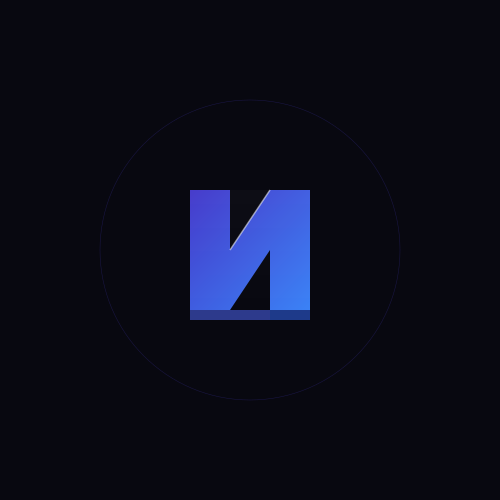

# Nexus3D: Web3-based Rapid 3D Scene Generation Platform

<div align="center">
  
</div>

Nexus3D is a Web3-based platform for rapid 3D scene generation, designed to create an open, efficient, and fair ecosystem for 3D asset creation and trading through blockchain technology, AI generation technology, and decentralized storage solutions.

<div align="center">
  <a href="https://github.com/Nexus-3D/Nexus3D/stargazers"></a>
  <a href="https://github.com/Nexus-3D/Nexus3D/network/members"></a>
  <a href="https://github.com/Nexus-3D/Nexus3D/pulls"></a>
  <a href="https://github.com/Nexus-3D/Nexus3D/issues"></a>
  <a href="https://github.com/Nexus-3D/Nexus3D/blob/main/LICENSE"></a>
</div>

<div align="center">
  <h3>🔗 Connect with Nexus3D</h3>
  <a href="https://github.com/Nexus-3D/Nexus3D"></a>
  <a href="https://x.com/Nexus_3D1"></a>
  <a href="https://nexus-3d.xyz"></a>
</div>

## Table of Contents

- [Project Vision](#project-vision)
- [Project Status](#project-status)
- [System Architecture](#system-architecture)
- [MVP Core Features](#mvp-core-features)
- [Development Workflow](#development-workflow)
- [Technology Stack](#technology-stack)
- [Getting Started](#getting-started)
- [Roadmap](#roadmap)
- [Contributions](#contributions)
- [License](#license)
- [Acknowledgements](#acknowledgements)

## Project Vision

To become the infrastructure for 3D content creation and application in the Web3 era, lowering the barriers to 3D creation, promoting the prosperity of the metaverse content ecosystem, and ensuring the rights of creators through blockchain technology.

## Project Status

<div align="center">
  <table>
    <tr>
      <th>Module</th>
      <th>Progress</th>
      <th>Status</th>
    </tr>
    <tr>
      <td>Core Engine</td>
      <td>
        
      </td>
      <td>Beta Testing</td>
    </tr>
    <tr>
      <td>Marketplace</td>
      <td>
        
      </td>
      <td>In Development</td>
    </tr>
    <tr>
      <td>AI Integration</td>
      <td>
        
      </td>
      <td>Early Stage</td>
    </tr>
    <tr>
      <td>Web3 Integration</td>
      <td>
        
      </td>
      <td>Near Completion</td>
    </tr>
    <tr>
      <td>UI/UX</td>
      <td>
        
      </td>
      <td>Final Refinement</td>
    </tr>
  </table>
</div>

## System Architecture

The Nexus3D platform architecture consists of several interconnected components:

```
┌─────────────────────┐      ┌─────────────────────┐
│                     │      │                     │
│   Client Frontend   │◄────►│   Backend Services  │
│   (React, Three.js) │      │   (Next.js API)     │
│                     │      │                     │
└────────┬────────────┘      └──────────┬──────────┘
         │                              │
         │                              │
         ▼                              ▼
┌─────────────────────┐      ┌─────────────────────┐
│                     │      │                     │
│   3D Scene Engine   │      │   Blockchain Layer  │
│   (React Three      │      │   (Smart Contracts) │
│    Fiber)           │      │                     │
│                     │      │                     │
└─────────────────────┘      └──────────┬──────────┘
                                        │
                                        │
                                        ▼
                             ┌─────────────────────┐
                             │                     │
                             │   Storage Layer     │
                             │   (IPFS)            │
                             │                     │
                             └─────────────────────┘
```

### Data Flow

1. **Creation Flow**:
   - User creates/edits 3D content in the editor
   - Scene data is processed by the 3D engine
   - Completed scenes are exported and prepared for storage/minting
   - Assets are stored on IPFS with metadata
   - NFT is minted on the blockchain with IPFS reference

2. **Marketplace Flow**:
   - Assets are listed in the marketplace
   - Smart contracts manage ownership and transactions
   - Users can purchase, trade, and collect 3D assets
   - Royalties are automatically distributed to creators

## MVP Core Features

The current version implements the following core features:

1. **Basic Creation Engine**
   - 3D scene editor
   - Simple template library
   - Basic AI-assisted generation

2. **Simplified Asset Market**
   - NFT minting functionality
   - Asset listing and display
   - Basic trading features

3. **Web3 Wallet Integration**
   - Multi-wallet support
   - Asset ownership verification
   - Transaction signing

## Development Workflow

Our development process follows an agile methodology with two-week sprints:

1. **Planning**: Define features and priorities
2. **Development**: Implement features with continuous integration
3. **Testing**: Unit tests, integration tests, and user acceptance testing
4. **Deployment**: Staged deployments (dev, staging, production)
5. **Review**: Sprint retrospective and planning for next cycle

<div align="center">
  
</div>

## Technology Stack

- **Frontend**: 
  - React for UI components
  - Next.js for server-side rendering
  - Three.js for 3D rendering
  - React Three Fiber as React wrapper for Three.js
  - Drei for Three.js helpers
  
- **Blockchain & Web3**:
  - Ethers.js for blockchain interaction
  - Web3Modal for wallet connections
  - Polygon for scalable transactions
  
- **Storage**:
  - IPFS for decentralized storage
  - Pinata for IPFS pinning service
  
- **UI/UX**:
  - TailwindCSS for styling
  - Framer Motion for animations
  
- **Development Tools**:
  - TypeScript for type safety
  - ESLint for code quality
  - Jest for testing

## Getting Started

### Prerequisites

- Node.js 16+
- MetaMask or other Ethereum wallet
- Connected to Polygon testnet

### Installation

```bash
# Clone the repository
git clone https://github.com/Nexus-3D/Nexus3D.git
cd Nexus3D

# Install dependencies
npm install

# Set up environment variables
cp .env.example .env.local
# Edit .env.local with your API keys and configuration

# Start development server
npm run dev
```

### Usage Examples

1. **Creating a New Scene**:

```javascript
import { SceneEditor } from 'nexus3d';

// Initialize the editor
const editor = new SceneEditor({
  container: document.getElementById('editor-container'),
  templates: ['room', 'outdoor', 'abstract'],
});

// Load a template
editor.loadTemplate('room');

// Add a custom object
editor.addObject({
  type: 'cube',
  position: [0, 1, 0],
  scale: [1, 1, 1],
  material: 'standard',
});

// Save the scene
const sceneData = editor.serializeScene();
```

2. **Minting an Asset**:

```javascript
import { mintAsset } from 'nexus3d/utils/contractService';

// Mint a new asset
const mintAsset = async () => {
  const result = await mintAsset({
    name: 'My 3D Creation',
    description: 'A beautiful 3D scene created with Nexus3D',
    sceneData: sceneData,
    price: '0.1',
    royaltyPercentage: 10,
  });
  
  console.log('Asset minted with ID:', result.tokenId);
};
```

## Roadmap

We are continuously working to enhance Nexus3D with new features and improvements:

### Q3 2023
- [x] Core scene editor
- [x] Basic template library
- [x] Wallet integration
- [x] NFT contract development

### Q4 2023
- [x] IPFS integration
- [x] Marketplace MVP
- [ ] Basic AI generation
- [ ] User profiles

### Q1 2024
- [ ] Advanced AI generation features
- [ ] 3D asset library expansion
- [ ] Collaborative editing
- [ ] Performance optimizations

### Q2 2024
- [ ] Mobile responsiveness
- [ ] Complete asset marketplace
- [ ] Creator dashboard
- [ ] DAO governance system

### Future
- [ ] VR/AR support
- [ ] Custom smart contract templates
- [ ] Interoperability with other metaverse platforms
- [ ] Creator incentives and royalty system

## Contributions

We welcome community contributions! Whether it's adding features, fixing bugs, improving documentation, or suggesting ideas, your input is valuable.

### How to Contribute

1. Fork the repository
2. Create a feature branch (`git checkout -b feature/amazing-feature`)
3. Make your changes
4. Commit your changes (`git commit -m 'Add some amazing feature'`)
5. Push to the branch (`git push origin feature/amazing-feature`)
6. Open a Pull Request

Please refer to the [Contribution Guidelines](CONTRIBUTING.md) for more detailed information.

## License

This project is licensed under the MIT License - see the [LICENSE](LICENSE) file for details.

## Acknowledgements

- [Three.js](https://threejs.org/) - 3D JavaScript library
- [React Three Fiber](https://github.com/pmndrs/react-three-fiber) - React renderer for Three.js
- [Polygon](https://polygon.technology/) - Ethereum scaling solution
- [IPFS](https://ipfs.tech/) - InterPlanetary File System
- [All Contributors](CONTRIBUTORS.md) - People who have contributed to the project 